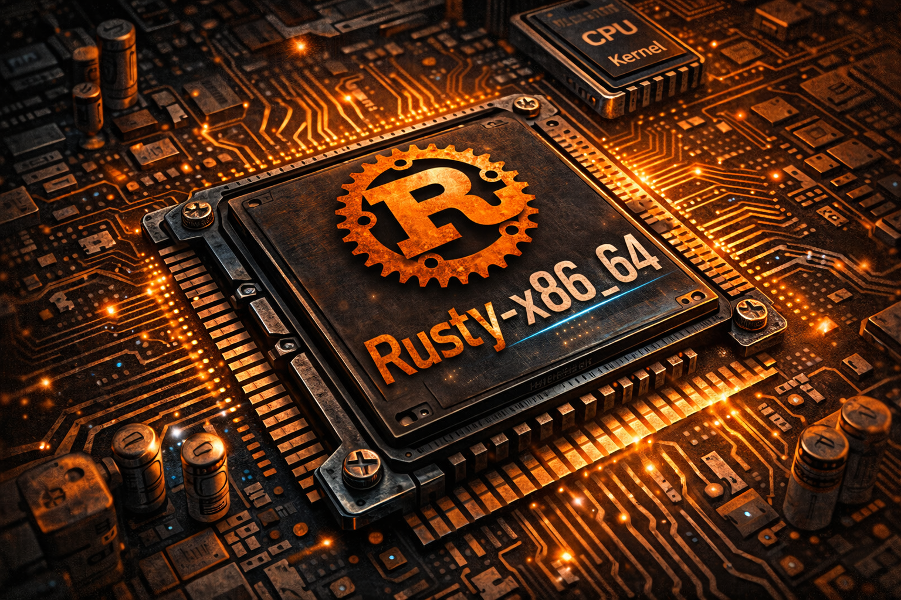

<p align="center">
  
</p>


<h1 align="center">
  Rusty x86_64 — Rust OS Kernel
</h1>

<p align="center">
  
</p>


<p align="center">
  🚀 A tiny yet powerful <strong>bare-metal x86_64 Operating System</strong> written in <strong>Rust</strong>.  
  Featuring paging, heap allocation, CPU + hardware interrupts, VGA text rendering, serial output, and QEMU testing.
</p>

---

<p align="center">
  
  
  
  
  
  
  
  
  
  
  
  
  
  
  
  
</p>


---

## About This Repo
<p align="center">
  <video width="70%" controls>
    <source src="assets/repo_vid.mp4" type="video/mp4">
    Your browser does not support the video tag.
  </video>
</p>

**Rusty x86_64** is a freestanding operating system kernel written in Rust.  
The project demonstrates how to build a kernel from scratch without relying on any standard library.  

Key learning objectives:

- Bare-metal kernel booting  
- CPU exceptions and double fault handling  
- Hardware interrupt handling (timer, keyboard)  
- Memory management: paging & custom heap allocators  
- VGA text mode and serial output  
- Kernel-level unit testing  
- Running inside QEMU

---
## 🧩 Features

- **Bare-metal support:** Runs directly on hardware / QEMU  
- **Custom boot screen:** ASCII Rust OS logo + progress indicators  
- **Memory management:** Paging and heap allocation with multiple allocator designs  
- **Interrupt handling:** CPU exceptions, double faults, hardware interrupts  
- **VGA + Serial I/O:** Safe interfaces for printing text  
- **Testing:** Kernel-level unit and integration tests  
- **Automation:** `run-qemu.sh` script for easy testing  
---
## 📂 Project Structure
```
├── Cargo.toml
├── .gitignore
├── x86_64-os.json
├── run-qemu.sh
├── src/
│ ├── allocator/
│ │ ├── bump.rs
│ │ ├── fixed_size_block.rs
│ │ └── linked_list.rs
│ ├── allocator.rs
│ ├── boot_screen.rs
│ ├── gdt.rs
│ ├── interrupts.rs
│ ├── lib.rs
│ ├── macros.rs
│ ├── main.rs
│ ├── memory.rs
│ ├── serial.rs
│ └── vga_buffer.rs
└── tests/
├── basic_boot.rs
├── interrupts.rs
├── serial_macros.rs
├── should_panic.rs
└── stack_overflow.rs
```
---
## 🛠 Build & Run
1. Install Rust and `bootimage`:
```bash
rustup component add rust-src llvm-tools-preview
cargo install bootimage
```
2. Build the kernel:
```bash
cargo bootimage
```
3. Run in QEMU
```bash
cargo run
```
---
## 🙏 Acknowledgements

- Huge thanks to **[Philipp Oppermann](https://os.phil-opp.com/)** for his excellent **“Writing an OS in Rust”** tutorial series, which inspired and guided this project.
